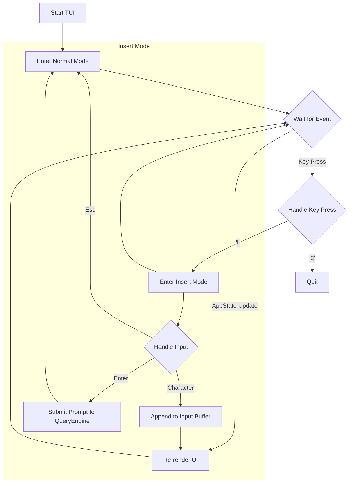

# Loom Application Architecture

This document provides a comprehensive overview of the Loom application's architecture. It is intended for developers who are contributing to, maintaining, or simply trying to understand the codebase. It details the core modules, their responsibilities, key data structures, and the critical operational flows that govern the application's behavior.

## Codebase Philosophy

The Loom codebase is designed with several key principles in mind to ensure it is robust, maintainable, and extensible.

*   **Asynchronous Operations**: The application heavily relies on asynchronous programming using `tokio`. This is crucial for performance, as it allows the application to handle I/O-bound operations (like making API calls to the AI provider, reading files, or executing shell commands) without blocking the main thread. This is especially important for the interactive TUI, ensuring it remains responsive to user input while background tasks are running.

*   **Modularity and Separation of Concerns**: The codebase is organized into distinct modules, each with a clear and well-defined responsibility. For example, `provider` handles all communication with external AI services, `tui` manages the user interface, and `engine` contains the core application logic. This separation makes the code easier to navigate, test, and refactor.

*   **Robust Error Handling**: The application uses the `anyhow` and `color_eyre` crates for error handling. This provides a unified error type (`anyhow::Result`) that simplifies error propagation and ensures that errors are reported with detailed, user-friendly context and backtraces, which is invaluable for debugging.

*   **State Management**: The application's state is centralized in the `state::AppState` struct. This makes it easier to reason about the application's data, as it provides a single source of truth for information like conversation history, current working directory, and session status.

*   **Dependency Management**: Dependencies are managed using Cargo, Rust's standard package manager. The `Cargo.toml` file defines all project dependencies, and `Cargo.lock` ensures that builds are reproducible.

## Core Modules

The `src/` directory contains the following modules, each responsible for a specific aspect of the application:

*   **`cli`**: Handles command-line interface argument parsing using `clap`. It defines the structure for all command-line inputs and options, performing initial validation and providing structured access to user-specified parameters (e.g., `--model`, `--prompt`, `--dump-system-prompt`).

*   **`config`**: Manages application-wide settings and configuration. This module is responsible for loading global, project-specific, and user-defined settings, ensuring configuration directories exist, and handling default settings. It manages details such as AI model selection, default project paths, and authentication methods.

*   **`engine`**: Contains the core business logic, centered around the `QueryEngine`. This engine orchestrates the entire AI interaction lifecycle. It constructs the system prompt, sends requests to the AI provider, processes responses, and manages the tool-use loop. The `QueryEngine` is the bridge between the user interface (TUI or CLI) and the AI provider.

*   **`git`**: Provides functionality for interacting with Git repositories. This includes identifying the root of a Git repository and reading `.gitignore` files to filter the files and directories that are included in the AI's context.

*   **`permissions`**: Manages how the application handles sensitive operations, primarily the execution of shell commands by the AI. It defines different permission modes (`Bypass`, `AutoApprove`, `Interactive`) that dictate whether the AI can execute commands directly or requires explicit user approval.

*   **`provider`**: Abstracts interactions with external AI services.
    *   **`provider::vertex`**: Implements the client for Google Cloud Vertex AI, handling the construction of API requests and the parsing of responses from the Gemini models.
    *   **`provider::auth`**: Manages authentication with Google Cloud, primarily using the application default credentials mechanism.

*   **`state`**: Manages the mutable state of the application through the `AppState` struct. This includes the session history (user prompts and AI responses), the current working directory, and other dynamic data that persists throughout a session.

*   **`tools`**: Provides the `ToolRegistry`, which holds and manages the collection of functions that the AI can invoke. These tools include `ReadFile`, `WriteFile`, `Bash`, `Grep`, `Glob`, `AskUser`, and `Agent`. The registry is responsible for dispatching tool calls from the AI to the appropriate Rust function and returning the results.

*   **`tui`**: Implements the Terminal User Interface. It uses the `ratatui` crate for rendering and `crossterm` for terminal manipulation. It manages an interactive event loop, captures user input, and displays the application state, AI responses, and tool outputs.

*   **`utils`**: Contains general-purpose utility functions and helpers that are used across different modules, such as file system helpers and error handling patterns.

*   **`lib.rs`**: The main library file, which declares the public modules of the application.

*   **`main.rs`**: The application's entry point. It orchestrates the setup of the application, initializes all the core components, and dispatches to either the interactive TUI or a single non-interactive query based on the CLI arguments.

## Application Initialization Flow

The main application flow, as defined in `main.rs`, can be summarized as follows:

```mermaid
graph TD
    A[Start Application] --> B{Parse CLI Arguments};
    B --> C[Initialize Logging & Error Handling];
    C --> D[Ensure Config Directories (Config)];
    D --> E[Load Settings (Config)];
    E --> F[Initialize Git Service & Set CWD (Git)];
    F --> G[Resolve Permission Mode (Permissions)];

    G --> H{--dump-system-prompt?};
    H -- Yes --> I[Build & Dump System Prompt (Engine)];
    I --> J[Exit];

    H -- No --> K[Authenticate with GCP (Provider)];
    K --> L[Create Vertex AI Client (Provider)];
    L --> M[Build Initial AppState (State)];
    M --> N[Create ToolRegistry (Tools)];
    N --> O[Create QueryEngine (Engine)];

    O --> P{CLI Prompt Provided?};
    P -- Yes --> Q[QueryEngine.query(cli_prompt)];
    Q --> R[Render Response to Console];
    R --> J;

    P -- No --> S[Initialize and Run TUI (Tui)];
    S --> J;
```

## Detailed Architectural Flows

### State Management: The `AppState` Struct

The `AppState` struct is the single source of truth for the application's mutable state during a session. It is instantiated in `main.rs` and passed to the `QueryEngine` and the `TUI`.

Key fields in `AppState` include:
*   `messages`: A vector of `Message` structs that stores the entire conversation history between the user and the AI, including tool calls and their results. This history is sent with each new query to provide context to the AI.
*   `cwd`: The current working directory of the application. This is used to resolve relative paths in tool calls.
*   `git_root`: The root directory of the Git repository, if one is found. This is used for context filtering.
*   `status`: An enum that represents the current status of the application (e.g., `Idle`, `WaitingForAI`, `ProcessingTools`). This is particularly important for the TUI to know what to display.

### The AI Query and Tool-Use Loop

The core of the application's logic resides in the `QueryEngine::query` method. This function implements a loop that allows the AI to not only respond with text but also to invoke tools to interact with the user's system.

```mermaid
graph TD
    A[User Submits Prompt] --> B[QueryEngine.query()];
    B --> C[Add User Message to AppState];
    C --> D[Send Request to AI Provider (including history)];
    D --> E{AI Response Received};
    E --> F{Response contains Tool Calls?};
    F -- No --> G[Add AI Message to AppState];
    G --> H[Render Final Response];
    H --> I[End];

    F -- Yes --> J[Execute Tools in Parallel];
    J --> K[Wait for all Tools to Complete];
    K --> L[Add Tool Results to AppState];
    L --> D;
```

**Step-by-step Breakdown:**

1.  **User Prompt**: The user submits a prompt, either via the CLI or the TUI.
2.  **Add to History**: The user's prompt is added to the `messages` history in `AppState`.
3.  **Send to AI**: The `QueryEngine` sends the entire message history, along with the system prompt, to the AI provider.
4.  **Receive Response**: The AI provider responds. The response can contain either a final text answer or a request to execute one or more tools.
5.  **Check for Tool Calls**:
    *   **If no tool calls**: The AI's text response is considered the final answer. It is added to the message history, rendered to the user, and the loop terminates.
    *   **If there are tool calls**: The `QueryEngine` proceeds to execute them.
6.  **Execute Tools**: Each tool call requested by the AI is executed by the `ToolRegistry`. This might involve reading a file, running a shell command, etc. Multiple tool calls are often executed in parallel for efficiency.
7.  **Add Results to History**: The output of each tool execution is captured and added to the `messages` history in `AppState` as a `Tool` message.
8.  **Return to Step 3**: The loop repeats. The `QueryEngine` sends the updated history, now including the tool results, back to the AI. The AI now has the context of the tool outputs and can use that information to formulate its next response, which might be the final answer or another set of tool calls.

This loop continues until the AI provides a response that does not contain any tool calls.

### TUI Event Loop

When no CLI prompt is provided, the application enters interactive mode by running the TUI. The TUI has its own event loop, which is responsible for handling user input and managing the UI's state.



**TUI Modes:**

*   **Normal Mode**: The default mode. The user can navigate, scroll, and use keyboard shortcuts. Typing `'i'` enters Insert Mode.
*   **Insert Mode**: In this mode, the user can type their prompt into the input box. Pressing `Enter` submits the prompt to the `QueryEngine`. Pressing `Esc` returns to Normal Mode.

**Event Handling:**

1.  The TUI event loop continuously listens for events (e.g., key presses, terminal resizes).
2.  It also listens for updates to `AppState`, which are signaled by the `QueryEngine` when the AI responds or tool outputs are generated.
3.  When a key press occurs, the TUI's event handler processes it based on the current mode.
4.  When `AppState` is updated, the TUI is re-rendered to reflect the new state (e.g., to show a new message from the AI).
5.  When the user submits a prompt, the TUI calls `QueryEngine.query()` in a separate asynchronous task. This prevents the UI from freezing while waiting for the AI's response. The TUI then displays the status from `AppState` (e.g., "Waiting for AI...") until the response is received.
